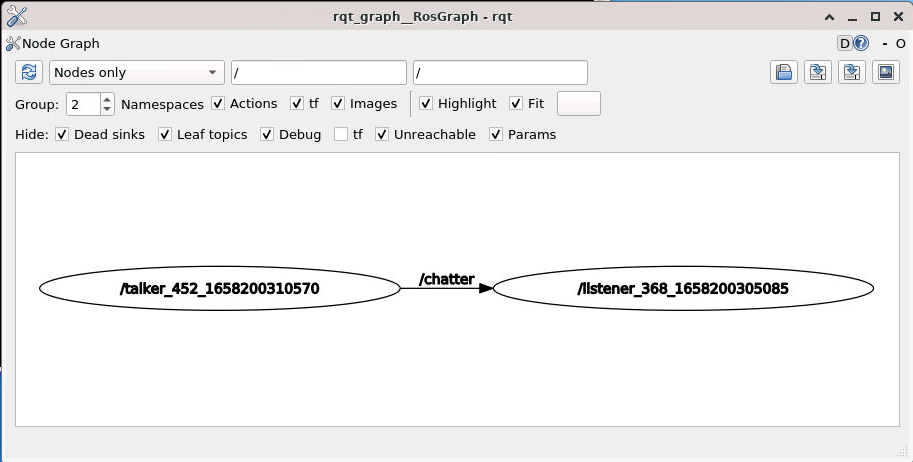

# ROS basics

[README](../README.md)

---

## Objectives

This page explains `ROS` basics.

## Prerequisite

You have to finish [Preparation](../preparation/preparation.md).

## What's ROS ?

- [ROS website](http://www.ros.org/)

`ROS` is the abbreviation of 'Robot Operating System'. It's a kind of middle-ware which helps to build distributed computing systems.

More simply, `ROS` helps programming including inter-process communcation, and provides very useful libralies and tools for robotics.

## Why 'distributed computing systems' ?

Robotics systems require many functionalites, such as

- Voice recognition
- Image processing
- Vehicle control
- Manipulator control, etc.

If you make 'one' large program which includes all of the functionalties, there are many disadvantages.

- One small change on a function causes unexpected effects to all over the program.
- One small run-time error of the program crushes your robotics system.
- It's difficult to break down the 'one' program for team development.

## ROS terminology

- `Node`: one executable program of the `ROS`.
- `Topic`: data for communiation between `Nodes`. It's have a data type such as String, Int64 and so on.
- `Publisher`: The `Nodes` which send `Topic`.
- `Subscriber`: The `Nodes` which recieve `Topic`.
- `ROS master`: A program which binds `Nodes`.
- `Work space`: A directory which stores `ROS` programs. In general, `~/catkin_ws` is used.
- `Package`: A group of `Nodes`.

## ROS master

Open a linux terminal emulator. See [Use terminal Emulator in the ROS Container](https://github.com/oit-ipbl/portal/blob/main/setup/dockerros.md#use-terminal-emulator-in-the-ros-container), and input the following command to run the `ROS master`.

```shell
$ roscore
... logging to /home/ubuntu/.ros/log/9474a7ce-4941-11ea-a3d0-000c2924787d/roslaunch-ubuntu-7288.log
Checking log directory for disk usage. This may take awhile.
Press Ctrl-C to interrupt
Done checking log file disk usage. Usage is <1GB.

started roslaunch server http://ubuntu:34303/
ros_comm version 1.14.3


SUMMARY
========

PARAMETERS
 * /rosdistro: melodic
 * /rosversion: 1.14.3

NODES

auto-starting new master
process[master]: started with pid [7299]
ROS_MASTER_URI=http://ubuntu:11311/

setting /run_id to 9474a7ce-4941-11ea-a3d0-000c2924787d
process[rosout-1]: started with pid [7310]
started core service [/rosout]
```

Check the messages. You can see the phrase, `'* /rosdistro: melodic'`.

### [Melodic Morenia](http://wiki.ros.org/melodic)

One of the LTS distribution of `ROS`.

- Press `Ctrl+C` to terminate `ROS master`.

```shell
^C[rosout-1] killing on exit
[master] killing on exit
shutting down processing monitor...
... shutting down processing monitor complete
done
```

### Checkpoint(ROS master)

- It's OK, you can run and terminlate `ROS master`.

## Simple publisher and subscriber (1)

- cf. [ROS/Tutorials/WritingPublisherSubscriber(python)](http://wiki.ros.org/ROS/Tutorials/WritingPublisherSubscriber%28python%29)

Type the following command.

```shell
$ roscd oit_pbl_ros_samples/scripts
```

### Question (1)

- Check the current working directory. Do you know the linux command for this ?

## roscd [package name]

This command changes the current working directory to a specific `ROS` package's directory.  
Let's go to another packages' directories by this command.

```shell
$ roscd navigation
$ pwd
/opt/ros/melodic/share/navigation
$ roscd rviz
$ pwd
/opt/ros/melodic/share/rviz
$ roscd oit_pbl_ros_samples/scripts # Return to our space.
```

## Simple publisher and subscriber (2)

Return to `oit_pbl_ros_samples/scripts`.

```shell
$ roscd oit_pbl_ros_samples/scripts
```

Download 2 files into the `scripts` directory.

- [talker.py](https://raw.github.com/ros/ros_tutorials/kinetic-devel/rospy_tutorials/001_talker_listener/talker.py)

```shell
$ wget https://raw.githubusercontent.com/ros/ros_tutorials/kinetic-devel/rospy_tutorials/001_talker_listener/talker.py
--2020-10-07 15:38:36--  https://raw.githubusercontent.com/ros/ros_tutorials/kinetic-devel/rospy_tutorials/001_talker_listener/talker.py
Resolving raw.githubusercontent.com (raw.githubusercontent.com)... 151.101.228.133
・・・
talker.py                                 100%[==================================================================================>]   2.17K  --.-KB/s    in 0s      

2020-10-07 15:38:37 (10.1 MB/s) - ‘talker.py’ saved [2217/2217]
```

- [listener.py](https://raw.github.com/ros/ros_tutorials/kinetic-devel/rospy_tutorials/001_talker_listener/listener.py)

```shell
$ wget https://raw.github.com/ros/ros_tutorials/kinetic-devel/rospy_tutorials/001_talker_listener/listener.py
--2020-10-07 15:40:18--  https://raw.github.com/ros/ros_tutorials/kinetic-devel/rospy_tutorials/001_talker_listener/listener.py
Resolving raw.github.com (raw.github.com)... 151.101.228.133
・・・
listener.py                               100%[==================================================================================>]   2.35K  --.-KB/s    in 0s      

2020-10-07 15:40:19 (7.51 MB/s) - ‘listener.py’ saved [2406/2406]
```

Edit the `talker.py` and `listener.py`.

- Open `~/catkin_ws/src/oit_pbl_ros_samples/` by Visual Studio Code editor, and edit the files in `~/catkin_ws/src/oit_pbl_ros_samples/scripts` directory.

Insert `# -*- coding: utf-8 -*-` at the top of the files like as follows,

```python
#!/usr/bin/env python
# -*- coding: utf-8 -*-
# Software License Agreement (BSD License)
```

### Question (2)

- Add executable permission to the downloaded 2 files. Do you know the linux command for this ?
- Check the permission with `ls -l` command.

```shell
$ ls -l
total 8
-rwxrw-r-- 1 robocup2020 robocup2020 2406  Feb 12 12:43 listener.py
-rwxrw-r-- 1 robocup2020 robocup2020 2217  Feb 12 12:43 talker.py
```

## Run talker.py

```shell
$ rosrun oit_pbl_ros_samples talker.py
```

It's not working because of some erros.  
If you successfully run the `talker.py`, you missed an instruction.

- Check the error message.

```shell
$ rosrun oit_pbl_ros_samples talker.py
[ERROR] [1623917414.259254]: Unable to immediately register with master node [http://localhost:11311]: master may not be running yet. Will keep trying.
```

- Press `Ctrl+C` to terminate the program.

## rosrun [package name] [node name]

This command launch a `Node` of a designated package.

- Basically, you have to run `ROS master` before execute a `Node`.

Open a linux terminal emulator and type `roscore` to run `ROS master`, and open another emulator for the following command.

```shell
$ rosrun oit_pbl_ros_samples talker.py
[INFO] [1581037099.621621]: hello world 1581037099.62
[INFO] [1581037099.722943]: hello world 1581037099.72
[INFO] [1581037099.822706]: hello world 1581037099.82
...
```

Open another emulator and run the following command.

```shell
$ rosrun oit_pbl_ros_samples listener.py
[INFO] [1581037131.453663]: /listener_8862_1581037131191I heard hello world 1581037131.45
[INFO] [1581037131.555024]: /listener_8862_1581037131191I heard hello world 1581037131.55
[INFO] [1581037131.658074]: /listener_8862_1581037131191I heard hello world 1581037131.65
...
```

Leave the 2 running `Nodes`, and type the next command on another terminal.

## rqt_graph

- Visualize the connection between 2 `Nodes`.

```shell
$ rqt_graph
```



## rostopic list

- This command shows all of the `Topics`.

```shell
$ rostopic list
/chatter
/rosout
/rosout_agg
```

## rostopic echo [topic name]

- This command outputs the data of a specified `Topic`.
- e.g. `rostopic echo /chatter`
  - You can use `tab` completion to input the `Topic` name.

```shell
$ rostopic echo /chatter
data: "hello world 1581037256.15"
---
data: "hello world 1581037256.25"
---
data: "hello world 1581037256.35"
...
```

## rostopic type [topic name]

This command shows a data type of the topic.

- e.g. `rostopic type /chatter`

```shell
$ rostopic type /chatter
std_msgs/String
```

You can see that the topic `/chatter` is String data.  
`ROS` has many standard data types. See [std_msgs](http://wiki.ros.org/std_msgs).

## Summary of talker.py

Open `talker.py` with an editor, and check.

```python
def talker():
    # Preparetion to publish String data through the topic 'chatter'
    pub = rospy.Publisher('chatter', String, queue_size=10)
    # Node initialization with the name 'talker'
    rospy.init_node('talker', anonymous=True)
    rate = rospy.Rate(10) # 10hz loop
    while not rospy.is_shutdown():
        hello_str = "hello world %s" % rospy.get_time()
        rospy.loginfo(hello_str) # Output of the variable of 'hello_str'
        pub.publish(hello_str) # Publish 'hello_str' to the 'chatter' topic
        rate.sleep()
```

## Summary of listener.py

Open the `listener.py` with an editor, and check.

```python
def callback(data):
    # Display received data
    rospy.loginfo(rospy.get_caller_id() + 'I heard %s', data.data)

def listener():
    rospy.init_node('listener', anonymous=True)
    # Preparation to subscrive 'chatter' topic.
    # A method named 'callback' will be called when new data arrived.
    rospy.Subscriber('chatter', String, callback)
    # Start loop.
    rospy.spin()

if __name__ == '__main__':
    listener()
```

### Terminate the programs

- Terminate `ROS master`, `talker.py`, `listener.py` with `Ctrl+C`.

### Checkpoint(talker, listener and rqt_graph)

- It's OK, you can run the talker and listener with rqt_graph visualization.

---

[README](../README.md)
