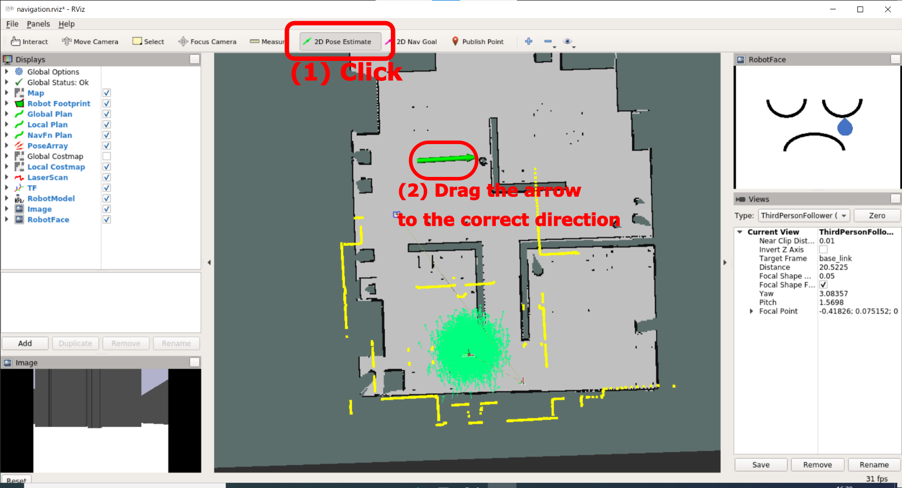

# Localization

[Preparation](./preparation.md)

---

## Objectives

This page explains how to use localization of the robot.
That is a supplementary explanation and is not essential.

## Prerequisite

You have to finish [ROS basics](./preparation.md).

## Procedure

A `ROS` robot can estimate its position and orientation on a room by matching between pre-obtained map shape and laser range finder's data.

- At first, you should drag the robot, that is a red block on the `Stage`.
- This causes localization error. You will see the mis-match between laser range finder's data (yellow points) and map in `RViz`.

Press `2D Pose Estimate` button on the `RViz`, and drag the arrow from the correct position on the map to correct direction of the robot.

It's OK when laser range finder's data (yellow points) matched the shape of the map raughly.

## **Imortant notice**

Localization is not necessary, because our simulator will finish localization while boot process.
If your robot losts its correct position, this process will be needed.

---

[Preparation](./preparation.md)
