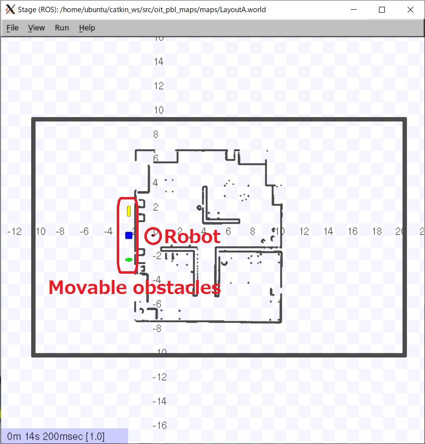
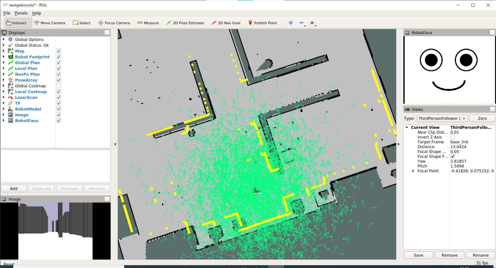
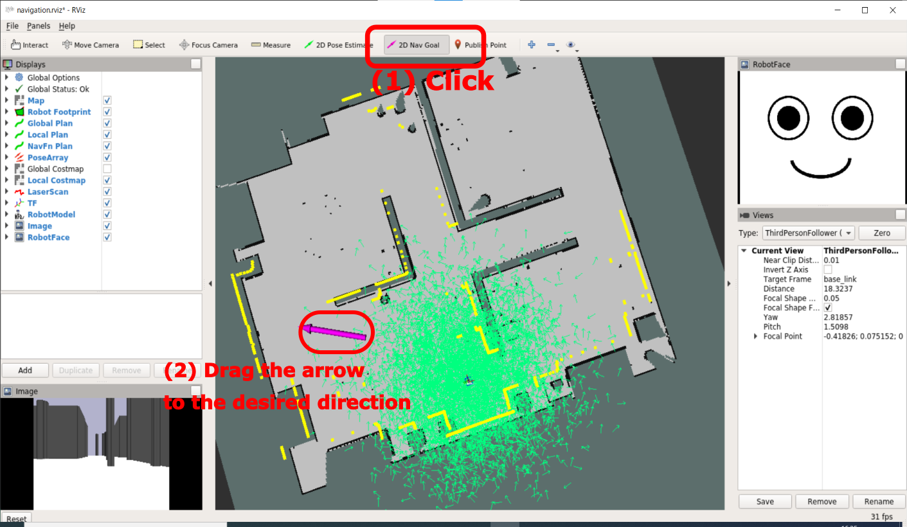
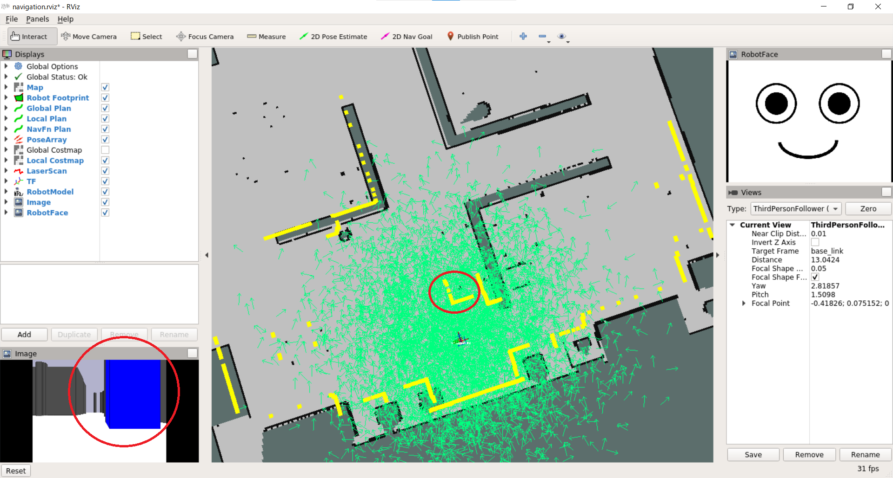
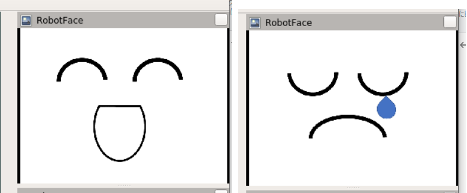

# Preparation

[README](../README.md)

---

## Objectives

This page explains how to setup learing environment for robot group and basic usage of the softwares.

## Prerequisite

You have to finish [Robot Development Environment for iPBL](https://github.com/oit-ipbl/portal/blob/main/setup/dockerros.md).

## Installation of softwares for robot group

Open a linux terminal emulator. See [Use terminal Emulator in the ROS Container](https://github.com/oit-ipbl/portal/blob/main/setup/dockerros.md#use-terminal-emulator-in-the-ros-container), and input the following commands.

```shell
$ cd ~/catkin_ws/src/
$ git clone https://github.com/KMiyawaki/oit_pbl_ros_samples.git
$ git clone https://github.com/KMiyawaki/oit_stage_ros.git
$ git clone https://github.com/KMiyawaki/oit_pbl_maps.git
$ ls
CMakeLists.txt oit_pbl_ros_samples oit_stage_ros oit_pbl_maps
$ cd ~/catkin_ws && catkin_make
Base path: /home/ubuntu/catkin_ws
Source space: /home/ubuntu/catkin_ws/src
Build space: /home/ubuntu/catkin_ws/build
Devel space: /home/ubuntu/catkin_ws/devel
Install space: /home/ubuntu/catkin_ws/install
...
-- Build files have been written to: /catkin_ws/build
####
#### Running command: "make -j8 -l8" in "/home/ubuntu/catkin_ws/build"
####
```

## Check robot simulator

Open a linux terminal emulator and type the following command.

```shell
$ roslaunch oit_stage_ros navigation.launch
```

### Explanations of GUI windows

- Simulation world generated by [`Stage`](https://github.com/rtv/Stage). [`Stage`](https://github.com/rtv/Stage) is a light-weight robotics simulator.



- `RViz`
  - Visualization software of `ROS`, which shows map, robot, robot's face, virtual camera's view and laser range finder's data (yellow points).



#### Checkpoint(simulator)

- It's OK, you can run the simulator.

## Test autonomus robot navigation

`Navigation` means autonomus robots' movements, which consists of following 2 steps.

1. Localization with a laser range finder and a map.
    - Manual localization method is [here](./localization.md), that is a supplementary explanation and is not essential.
2. Autonomus movements to the designated position with obstacle avoidance.

`ROS` provides the functionalities through `Navigation meta-package`, and you can use the robot navigation simply by indicating a navigation goal.

- cf. [ROS navigation](http://wiki.ros.org/navigation)

### Indicate a navigation goal

Press `2D Nav Goal` on the `RViz`, and drag from desired goal postion to desired robot direction.



#### Checkpoint(navigation)

- It's OK, you can use the navigation.

### Move the obstacle blocks on the Stage

You can drag the robot and colored obstacle blocks on the `Stage`.


You can see the blue block on the virtual camera view, and laser range finder's detection of the block (yellow points) as well in the `RViz` screen.



#### Checkpoint(move the objects)

- It's OK, you can move objects on the `Stage`.

## Robot's facial expression

1. If you closed the robot simulator, launch it agein with `roslaunch oit_stage_ros navigation.launch` command.
    - The command also launches `~/catkin_ws/src/oit_stage_ros/scripts/face_image_publisher.py`, which publishes face image.
    - You can see the robot's face on the `RViz`.
2. Open another emulator and type `rostopic pub /robot_face_type std_msgs/String "data: 'happy'" -1`, that changes robot's face.
    - You can use `'sad'` or `'normal'` alternatively.



### Checkpoint(change the face)

- It's OK, you can show the robot's faces, happy, normal and sad.

## Terminate the simulator

Press `Ctrl+C` on the linux emulator which launched the simulator.

## Referecne

- [How to Use Player/Stage](http://player-stage-manual.readthedocs.io/en/stable/)

---

[README](../README.md)
