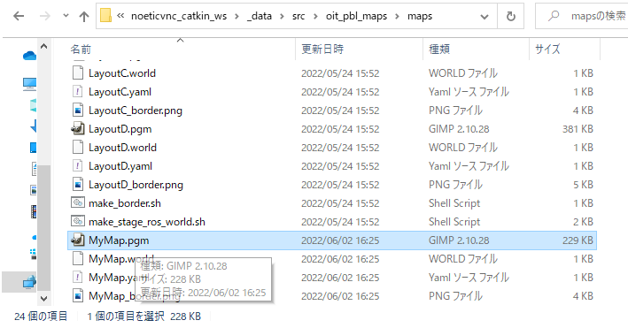
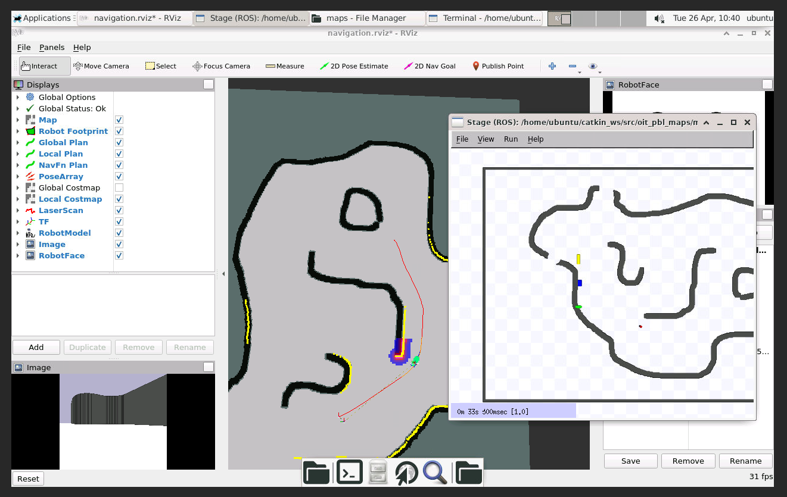

# Make original simulation world

[README](../README.md)

---

## Objectives

This page explains how to make your original simulation world.

You can make it by copying and editing the default world files which are located at `~/catkin_ws/src/oit_pbl_maps/maps`.

The new world can be used with `roslaunch oit_stage_ros navigation.launch` command by specifying the world name as a command line argment.

## Prerequisite

You have to finish [Robot control (3)](../robot_control/robot_control_03.md).

## Copy the default simulation world files

Hereafter, we assume that new simulation world's name is `MyMap`. You can use arbitrary name instead of that.

```shell
roscd oit_pbl_maps/maps
cp LayoutA.pgm MyMap.pgm
cp LayoutA.world MyMap.world
cp LayoutA.yaml MyMap.yaml
cp LayoutA_border.png MyMap_border.png
```

## Edit *.yaml

Edit `MyMap.yaml` by VSCode as follows,

- Before

```yaml
image: LayoutA.pgm
```

- After

```yaml
image: MyMap.pgm
```

[This is a sample of `MyMap.yaml`](./original_world/MyMap.yaml)

## Edit *.world

Edit `MyMap.world` by VSCode as follows,

- Before

```text
bitmap "./LayoutA_border.png"
```

- After

```text
bitmap "./MyMap_border.png"
```

[This is a sample of `MyMap.world`](./original_world/MyMap.world)

## Check roslaunch command with the new world name

Run the following command. `world_name:=MyMap` option can specify the new simulation world.

```shell
roslaunch oit_stage_ros navigation.launch world_name:=MyMap
```

Ofcourse, you can not see any changes before editing the map images.

## Edit map images of the new world

Switch to windows side and open the folder `\\wsl$\docker-desktop-data\version-pack-data\community\docker\volumes\noeticvnc_catkin_ws\_data\src\oit_pbl_maps\maps`.



Edit the `MyMap.pgm` with a photo-retouching software such as [Gimp](https://www.gimp.org/).

Note that, do not change the image size.

[This is a sample of `MyMap.pgm`](./original_world/MyMap.pgm)

Use the following three colors.

- Black: Obstacles.
- White: Free space.
- Gray: Except above.

Image format should be 8-bit grayscale. Gimp can export with this format.

After that, export the `MyMap.pgm` as `MyMap_border.png`, then add black boarder with about 5 pixels.

[This is a sample of `MyMap_border.png`](./original_world/MyMap_border.png)

## roslaunch with the new world

Run the following command.

```shell
roslaunch oit_stage_ros navigation.launch world_name:=MyMap
```

Now, you can see your original world.



## Change initial pose of the robot (optional)

Open `MyMap.world` with an editor, and see the middle of the file.

```text
robot
(
  # can refer to the robot by this name
  name "r0"
  pose [0 0 0 0] 
)
```

You can set the robot's initial pose by changing the `pose [0 0 0 0]`. That means `[x y z yaw]`. Yaw angle is defined as radian.

The explanation of `pose` is [here](https://player-stage-manual.readthedocs.io/en/stable/WORLDFILES/#3215-ranger-device).

## Referecne

- [How to Use Player/Stage| Building a World](https://player-stage-manual.readthedocs.io/en/stable/WORLDFILES/)

---

[README](../README.md)
