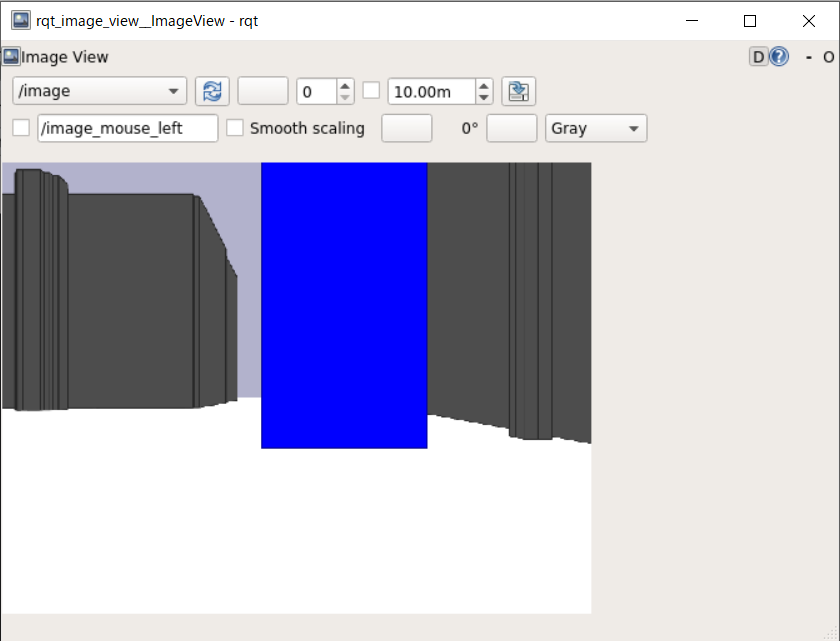
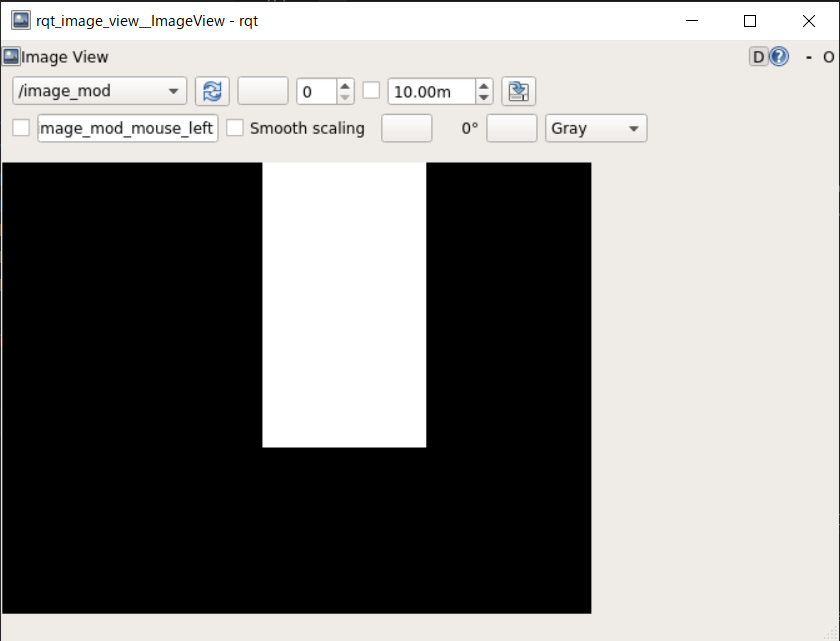

# Image Processing by Robot

[README](../README.md)

---

## Objectives

This page explains how to make a simple image processing program.  We will add some codes to `sensors.py`.

## Preparation(display sensor data)

- You can display various data sensed by the robot on the console.
  - For more information about data sensing, refer to the [sensor data](./sensor_data_01.md)
- Make a python file `sensors.py` inside of the `oit_pbl_ros_samples` package.  
Open a linux terminal emulator. See [Use terminal Emulator in the ROS Container](https://github.com/oit-ipbl/portal/blob/main/setup/dockerros.md#use-terminal-emulator-in-the-ros-container), and input the following commands.
  - If you already have created the `sensors.py`, please use it.

```shell
$ roscd oit_pbl_ros_samples/scripts
$ pwd
/home/ubuntu/catkin_ws/src/oit_pbl_ros_samples/scripts
$ touch sensors.py
$ chmod u+x sensors.py
```

- Open `~/catkin_ws/src/oit_pbl_ros_samples/` by Visual Studio Code editor, and edit `sensors.py`. See [Developing inside the ROS container with VSCode](https://github.com/oit-ipbl/portal/blob/main/setup/remote_with_vscode.md).

Type the following template. It's OK copy and paste.

```python
#!/usr/bin/env python
# -*- coding: utf-8 -*-

import os
import rospy
import tf
from sensor_msgs.msg import LaserScan, Image
from nav_msgs.msg import Odometry


class SensorMessageGetter(object):
    def __init__(self, topic, msg_type, msg_wait=1):
        self.msg_wait = msg_wait
        self.topic = topic
        self.msg_type = msg_type

    def get_msg(self):
        message = None
        try:
            message = rospy.wait_for_message(
                self.topic, self.msg_type, self.msg_wait)
        except rospy.exceptions.ROSException as e:
            rospy.logdebug(e)
        return message


class Sensors(object):
    def __init__(self):
        self.laser = SensorMessageGetter("/base_scan", LaserScan)
        self.img = SensorMessageGetter("/image", Image)

    def process_laser(self, msg):
        if msg:
            rospy.loginfo("Recv sensor data. type = %s", type(msg))
            # check reference
            # http://docs.ros.org/api/sensor_msgs/html/msg/LaserScan.html
            # len(msg.ranges) is range senseor's data count.
            rospy.loginfo("len(msg.ranges) = %d", len(msg.ranges))
            # msg.ranges[i] is distance mesurement of index i.
            rospy.loginfo("msg.ranges[0] = %f", msg.ranges[0])

    def process(self):
        rate=rospy.Rate(20)
        tm = rospy.Time.now()
        while (rospy.Time.now().to_sec() - tm.to_sec()) < 100:
            self.process_laser(self.laser.get_msg())
            rate.sleep()


def main():
    script_name=os.path.basename(__file__)
    rospy.init_node(os.path.splitext(script_name)[0])
    rospy.sleep(0.5)  # rospy.Time.now() returns 0, without this sleep.

    node=Sensors()
    rospy.loginfo("%s:Started", rospy.get_name())

    node.process()
    rospy.loginfo("%s:Exiting", rospy.get_name())


if __name__ == '__main__':
    try:
        main()
    except Exception as e:
        rospy.logerr("%s:%s", rospy.get_name(), str(e))
        exit(1)

```

### Run

At first, launch the simulator.

```shell
$ roslaunch oit_stage_ros navigation.launch
```

After a while run the `sensors.py`.

- You can see the information about received sensor data.
- This program will run about 100 seconds and stop automatically.

```shell
$ rosrun oit_pbl_ros_samples sensors.py
[INFO] [1624081858.601793, 16.200000]: /sensors:Started
[INFO] [1624081858.706859, 16.300000]: Recv sensor data. type = <class 'sensor_msgs.msg._LaserScan.LaserScan'>
[INFO] [1624081858.710373, 16.300000]: len(msg.ranges) = 720
[INFO] [1624081858.714078, 16.300000]: msg.ranges[0] = 1.412500
[INFO] [1624081859.008587, 16.600000]: Recv sensor data. type = <class 'sensor_msgs.msg._LaserScan.LaserScan'>
[INFO] [1624081859.011822, 16.600000]: len(msg.ranges) = 720
[INFO] [1624081859.014337, 16.600000]: msg.ranges[0] = 1.412500
:
:
```

## Practice (image processing for robot)

Open `~/catkin_ws/src/oit_pbl_ros_samples/` by Visual Studio Code editor, and edit `sensors.py`. See [Developing inside the ROS container with VSCode](https://github.com/oit-ipbl/portal/blob/main/setup/remote_with_vscode.md).

Additional codes are as follows,

### Add `import cv2`

```python
#!/usr/bin/env python
# -*- coding: utf-8 -*-

import os
import rospy
import tf
from sensor_msgs.msg import LaserScan, Image
from nav_msgs.msg import Odometry

import cv2  # add
from cv_bridge import CvBridge  # add
```

### Add initialization of `CvBridge`

```shell
class Sensors(object):
    def __init__(self):
        self.laser = SensorMessageGetter("/base_scan", LaserScan)
        self.img = SensorMessageGetter("/image", Image)
        # add
        self.cv_bridge = CvBridge()
        self.image_pub = rospy.Publisher("/image_mod", Image, queue_size=1)
```

### Add extraction of blue region

```python
    def process_img(self, msg):
        if msg:
            rospy.loginfo("Recv sensor data. type = %s", type(msg))
            # check reference
            # http://docs.ros.org/en/api/sensor_msgs/html/msg/Image.html
            rospy.loginfo("msg.width = %d, msg.height = %d",
                          msg.width, msg.height)
            # add
            try:
                cv_image = self.cv_bridge.imgmsg_to_cv2(msg, "bgr8")
                hsv = cv2.cvtColor(cv_image, cv2.COLOR_BGR2HSV)
                blue = cv2.inRange(hsv, (100, 200, 200), (140, 255, 255))
                send = self.cv_bridge.cv2_to_imgmsg(blue, "mono8")
                self.image_pub.publish(send)
            except Exception as e:
                rospy.logerr("%s:%s", rospy.get_name(), str(e))
```

### Change program running time

```python
    def process(self):
        rate = rospy.Rate(20)
        tm = rospy.Time.now()
        while (rospy.Time.now().to_sec() - tm.to_sec()) < 1000: # change 100 -> 1000
```

### Change process method of Sensors class

```python
    def process(self):
        rate=rospy.Rate(20)
        tm = rospy.Time.now()
        while (rospy.Time.now().to_sec() - tm.to_sec()) < 100:
            self.process_img(self.img.get_msg()) # self.process_laser(self.laser.get_msg())
            rate.sleep()
```

### Run

At first, launch the simulator.

```shell
$ roslaunch oit_stage_ros navigation.launch
```

Drag blue block to the front of the robot.


After a while run the `sensors.py`.

- You can see the information about received sensor data.

```shell
$ rosrun oit_pbl_ros_samples sensors.py
[INFO] [1654488044.770945, 515.600000]: /sensors:Started
[INFO] [1654488044.883135, 515.700000]: Recv sensor data. type = <class 'sensor_msgs.msg._Image.Image'>
[INFO] [1654488044.884449, 515.700000]: msg.width = 700, msg.height = 540
[INFO] [1654488044.981161, 515.800000]: Recv sensor data. type = <class 'sensor_msgs.msg._Image.Image'>
[INFO] [1654488044.983037, 515.800000]: msg.width = 700, msg.height = 540
```

Open another emulator and type the following command.

```shell
$ rqt_image_view
```

Image viewer window will come up. Select the `image` topic from the drop down box and you can see the image grabed by the virtual camera.



Select `image_mod`, and you can see the image processing result, which shows extracted blue colord region.



## :o:Exercise (image processing)

- Try to extract yellow and green objects like as the blue block.
- Important point of the code is here,

```python
                hsv = cv2.cvtColor(cv_image, cv2.COLOR_BGR2HSV) # Convert BGR color space to HSV.
                blue = cv2.inRange(hsv, (100, 200, 200), (140, 255, 255)) # Extract the pixels where 100<=H<=140, 200<=S<=255 and 200<=V<=255  
```

`cv2.cvtColor` converts the image `cv_image` from BGR to HSV (hue, saturation and value) color space. [HSV color space](https://en.wikipedia.org/wiki/HSL_and_HSV) is very useful to extract the pixels which have specific color. Basically we just need to indicate H value, which represents the color with [circle](https://en.wikipedia.org/wiki/HSL_and_HSV#/media/File:HSV_color_solid_cylinder_saturation_gray.png). The range of hue value is from 0 to 179 in OpenCV. See [Changing Colorspaces](https://docs.opencv.org/master/df/d9d/tutorial_py_colorspaces.html)

- Adjust the hue value in `cv2.inRange(hsv, (100, 200, 200), (140, 255, 255))` to extract other colored objects.


## Challenge (control robot by image processing)

- Turn the robot to the specific colored object.

---

[README](../README.md)
