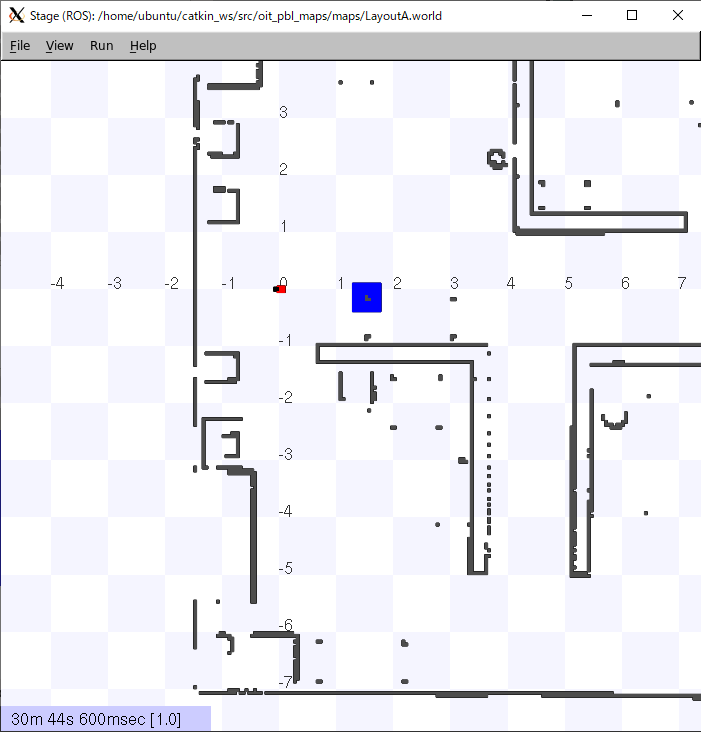

# Sensor data (2)

[README](../README.md)

---

## Objectives

This page explains how to make a simple image processing program.  We will add some codes to `sensors.py`.

## Prerequisite

You have to finish [Sensor data (1)](sensor_data/sensor_data_01.md).

## Practice (image processing for robot)

Edit the `sensors.py`.

- Open `~/catkin_ws/src/oit_pbl_ros_samples/` by Visual Studio Code editor, and edit `sensors.py`.

Additional codes are as follows,

### Add `import cv2`

```python
#!/usr/bin/env python
# -*- coding: utf-8 -*-

import os
import rospy
import tf
from sensor_msgs.msg import LaserScan, Image
from nav_msgs.msg import Odometry

import cv2  # add
from cv_bridge import CvBridge  # add
```

### Add initialization of `CvBridge`

```shell
class Sensors(object):
    def __init__(self):
        self.laser = SensorMessageGetter("/base_scan", LaserScan)
        self.odom = SensorMessageGetter("/odom", Odometry)
        self.img = SensorMessageGetter("/image", Image)
        # add
        self.cv_bridge = CvBridge()
        self.image_pub = rospy.Publisher("/image_mod", Image, queue_size=1)
```

### Add extraction of blue region

```python
    def process_img(self, msg):
        if msg:
            rospy.loginfo("Recv sensor data. type = %s", type(msg))
            # check reference
            # http://docs.ros.org/en/api/sensor_msgs/html/msg/Image.html
            rospy.loginfo("msg.width = %d, msg.height = %d",
                          msg.width, msg.height)
            # add
            try:
                cv_image = self.cv_bridge.imgmsg_to_cv2(msg, "bgr8")
                hsv = cv2.cvtColor(cv_image, cv2.COLOR_BGR2HSV)
                blue = cv2.inRange(hsv, (100, 200, 200), (140, 255, 255))
                send = self.cv_bridge.cv2_to_imgmsg(blue, "mono8")
                self.image_pub.publish(send)
            except Exception as e:
                rospy.logerr("%s:%s", rospy.get_name(), str(e))
```

### Change program running time

```python
    def process(self):
        rate = rospy.Rate(20)
        tm = rospy.Time.now()
        while (rospy.Time.now().to_sec() - tm.to_sec()) < 1000: # change 100 -> 1000
```

### Run

At first, launch the simulator.

```shell
$ roslaunch oit_stage_ros navigation.launch
```

Drag blue block to the front of the robot.



After a while run the `sensors.py`.

- You can see the information about received sensor data.

```shell
$ rosrun oit_pbl_ros_samples sensors.py
[INFO] [1624081858.601793, 16.200000]: /sensors:Started
[INFO] [1624081858.706859, 16.300000]: Recv sensor data. type = <class 'sensor_msgs.msg._LaserScan.LaserScan'>
[INFO] [1624081858.710373, 16.300000]: len(msg.ranges) = 720
[INFO] [1624081858.714078, 16.300000]: msg.ranges[0] = 1.412500
```

Open another emulator and type the following command.

```shell
$ rqt_image_view
```

Image viewer window will come up. Select the `image` topic from the drop down box and you can see the image grabed by the virtual camera.


Select `image_mod`, and you can see the image processing result, which shows extracted blue colord region.


## Checkpoint(sensor data 2)

- It's OK, you can finish the question 1.

## Challenge (sensor data 2-1)

- Try to extract yellow and green objects like as the blue block.

## Challenge (sensor data 2-2: difficult)

- Turn the robot to the specific colored object.

---

[README](../README.md)
